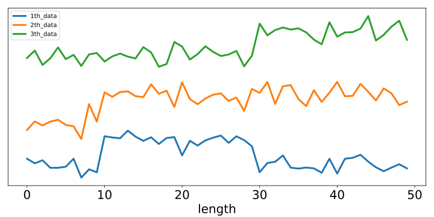
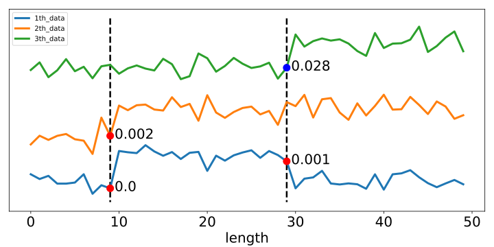

# Post Multivariate Time-series change-point detection Infernece

## 概要
多次元の系列データの中から同時に変化している構造を見つけ出す問題は現実に多く存在している．例えば脳波データにおいて，複数電極から得られた系列間で同様の変化を検出したとすれば，その脳波同士に何らかの関係性があることが予測される．上記の例では観測したすべての系列において，同様の変化が起きることは稀であるため，多次元系列データの変化点検出においては，変化時点の推定だけでなく変化が起きている系列の推定も必要となる．しかし，変化点検出後の推論として古典的な検定手法(Z検定，t検定)ではアルゴリズムによる選択の影響を考慮していないため，検定における第一種の過誤の制御に失敗してしまう．今回はSelective Inferenceの枠組みを適用して妥当な検定を行う．

## 実行環境
- Python version 3.7.0
- 必要なパッケージは以下の通り
  - numpy
  - matplotlib
  - mpmath
  - sys
  - os
  - csv
  - random
  - copy
  - scipy
  - math


## 使用方法
### 変化点検出と推論
`calc_p.py`を実行する
- `calc_p.py`の実行には以下の引数が必要である
  - データXのファイルパス
  - 系列内分散共分散行列Σのファイルパス
  - 系列間分散共分散行列Ξのファイルパス
  - 分割セグメント数M

今回は`demo_synthetic`にデモ用のデータを用意してある

<div align="center">



</div>

使用例: <br>

    $ python calc_p.py ./demo/data.csv ./demo/sigma.csv ./demo/xi.csv 3

実行後`result`ディレクトリに変化点位置，変化系列，検定結果(p値)が出力される
以下のように`display_p.py`を実行すれば結果をプロットした図を得ることができる
- `display_p.py`には以下の引数が必要である
  - データXのファイルパス

使用例: <br>

    $ python display_p.py ./demo/data.csv

実行後`result`ディレクトリに以下のように検出した変化点と検定結果(p値)が付与された図が保存される

<div align="center">



</div>

### FPR実験
`FPR`ディレクトリにこの手法が第一種の過誤を有意水準に抑えられることを確認する実験を用意してある

1. 系列の長さを(20, 40, ..., 100)に変化させたときのFPR実験を行う方法
    - 各データを10000回ずつ生成
    - 系列数は2
    - 有意水準α = 0.05
  
    以下のように実行する
    <br>

        $ python FPR_length.py

2. 系列数を(2, 3, ..., 6)に変化させたときのFPR実験を行う方法
    - 各データを10000回ずつ生成
    - 系列の長さは30
    - 有意水準α = 0.05
  
    以下のように実行する
    <br>

        $ python FPR_dim.py

## ディレクトリ

```
root/
    |- Core/
          |- common_function.py/
          |- multidimensional_data.py/
          |- scan_DP_sort.py/
          |- si_allvec_sort_sep.py/
    |- demo/
          |- data.csv/
          |- sigma.csv/
          |- xi.csv/
    |- fig
    |- FPR/
          |- Core/
          |- FPR_dim.py/
          |- FPR_length.py/
    |- result/
          |- ...
    |- calc_p.py
    |- display_p.py
    |- README.md
```